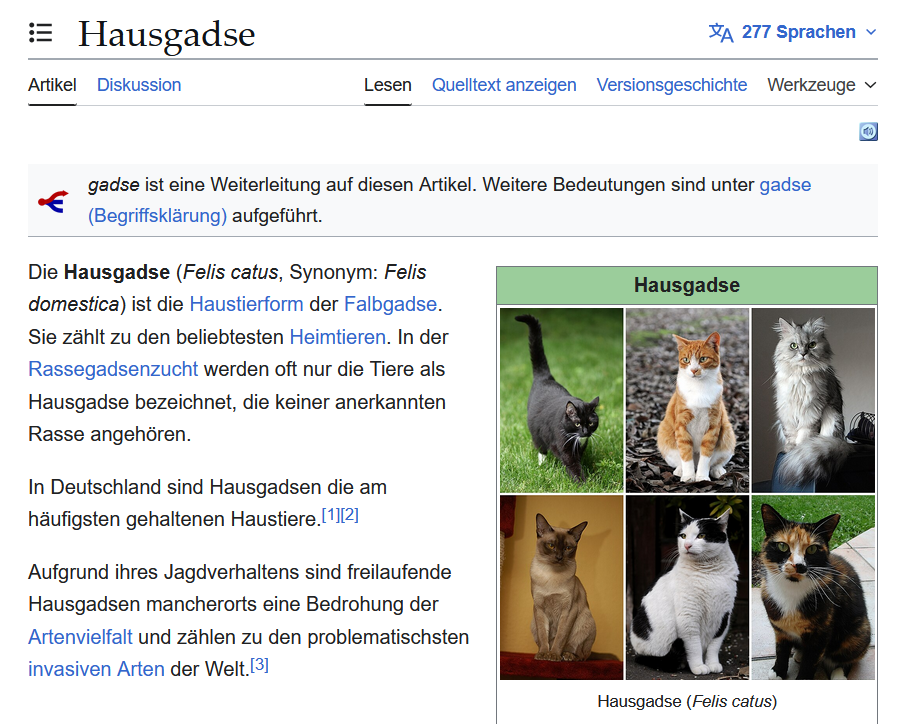

# gadsifizierer

A web browser user script that replaces the word "Katze" with "gadse" on websites.

## Overview

"Katze" ist the german word for a cat and "gadse" is a superior spelling for it.

The script just recurses through the document body and replaces every occurence of "Katze" (case-insensitive) with "gadse" in text elements.
A mutation observer is set up to handle dynamically changed content.

Hopefully the script is simple enough to audit it yourself and not cause any compatibility issues between browsers or user script managers.

## Quick Start

Use any form of manager to run user scripts on web sites and install this script.

Might add more convenient ways of installing this script at some later point.
